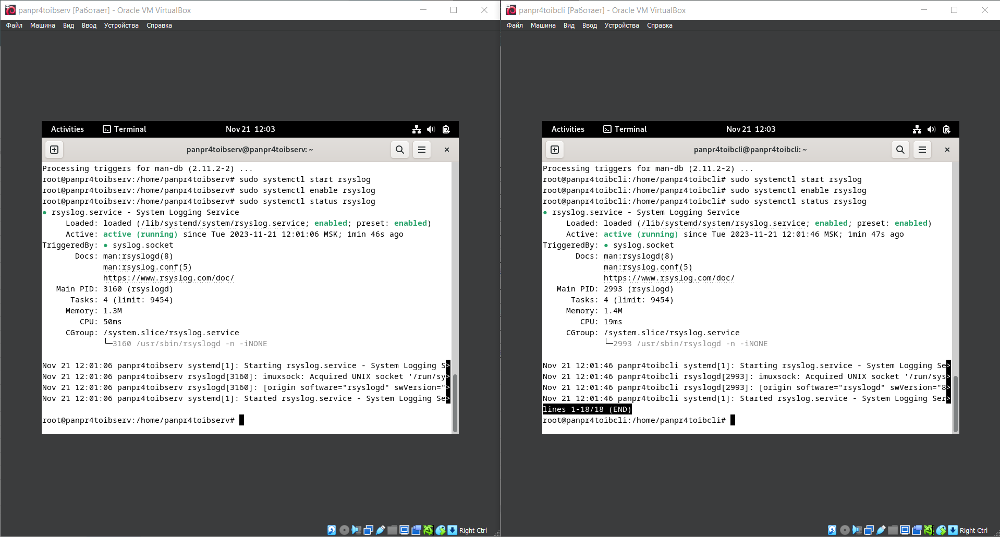
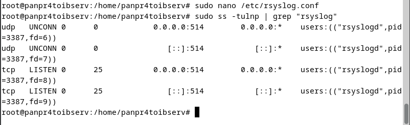
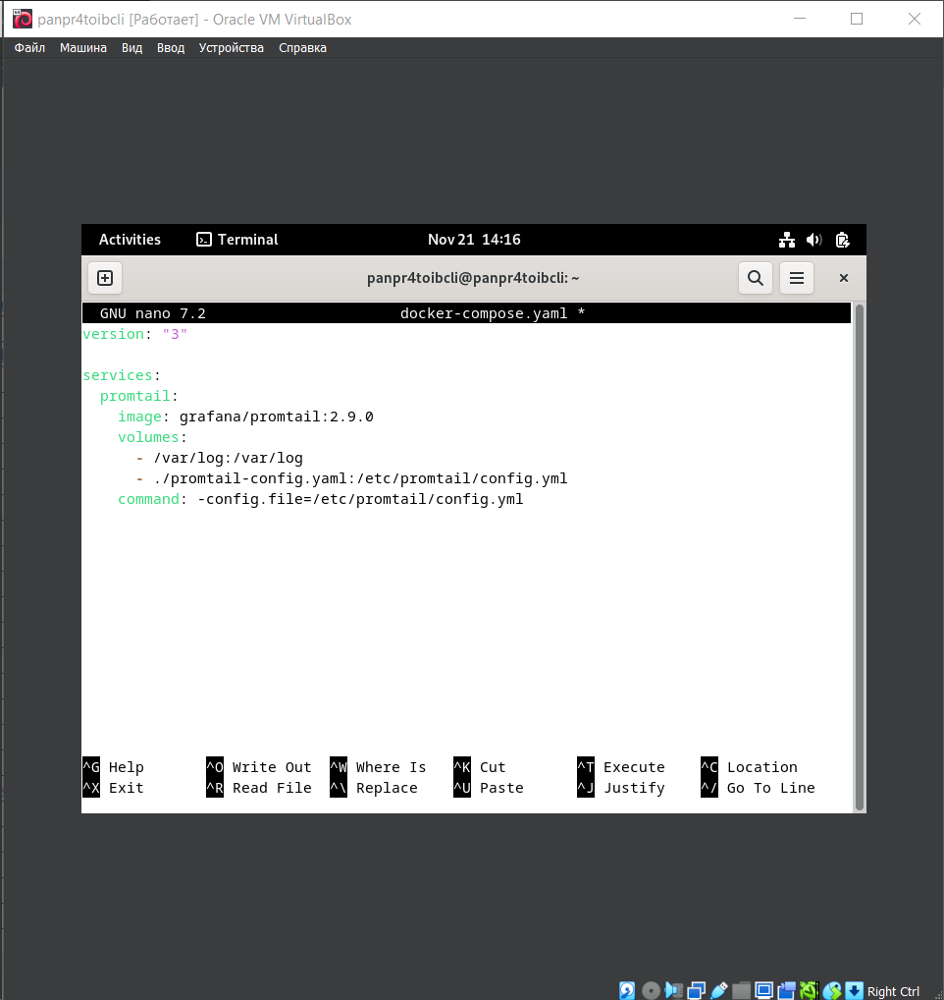

# **СДССиЛ Практическая работа номер 1 - Аггрегация и сбор логов**

Выполнил - Панков Евгений Ромуальдович

## **1. Создаем 2 виртуальные машины на базе ОС Debian 12 и обеспечиваем между ними сетевой обмен (Использовался VirtualBox как клиент виртуализации):**

   

   

   

## **2. Включаем на 1-ой (сервере) из ВМ передачу логов по протоколу rsyslog на 2-ую ВМ (клиент):**

### ***2.1 Устанавливаем и настраиваем rsyslog на сервере и клиенте:***

### ***2.2 Проверяем работоспособность rsyslog на сервере и клиенте:***

### ***2.3 Включаем UDP и TCP соединение:***

### ***2.4 Устанавливаем правила на сервере:***

### ***2.5 Установливаем правила на клиенте:***

### ***2.6 Проверяем получения логов на сервере:***

## **3. Устанавливаем и настраиваем получение логов на сервере с использованием Loki:**

### ***3.1 Устанавливаем и редактируем compose-файл на сервере:***

### ***3.2 Запускаем Loki:***

### ***3.3 Редактируем promtail на клиенте:***

### ***3.4 Редактируем compose-файл для promtail:***

### ***3.5 Запускаем promtail на клиенте:***

### ***3.6 Просматриваем логи клиента в Grafana Loki:***

## **4. Устанавливаем и настроиваем получение логов на сервере с использованием Signoz**

Установка Signoz согласно инструкции - <https://signoz.io/docs/install/docker/#install-signoz-using-docker-compose>

Установка приложения sample-nodejs-app согласно инструкции с сайта: <https://github.com/SigNoz/sample-nodejs-app/>

### ***4.1 Запускаем Signoz:***

### ***4.2 Редактируем конфигурации на клиенте для отправки данных в Signoz:***

### ***4.3 Запускаем клиентское приложение:***

### ***4.4 Проверяем получение логов в Signoz:***
