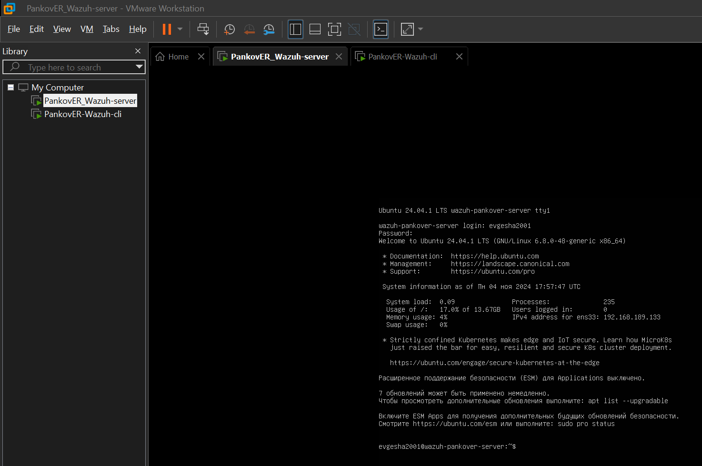
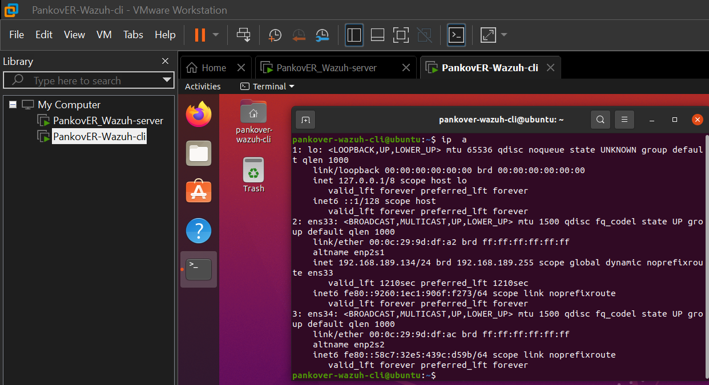
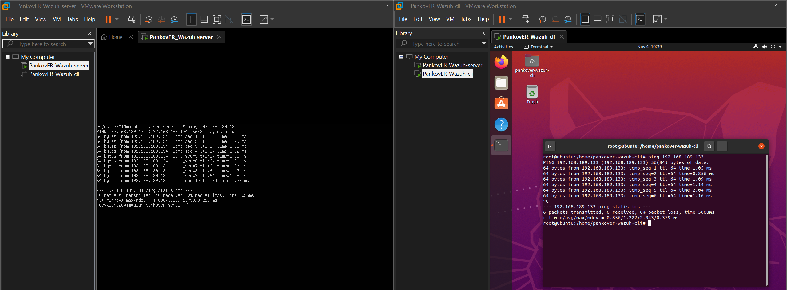
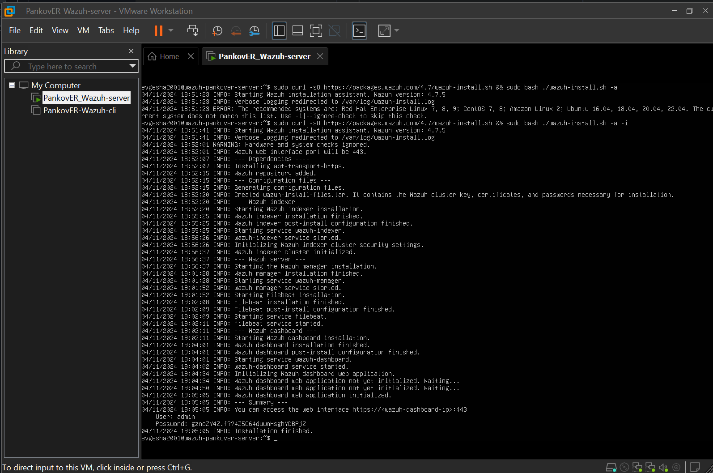
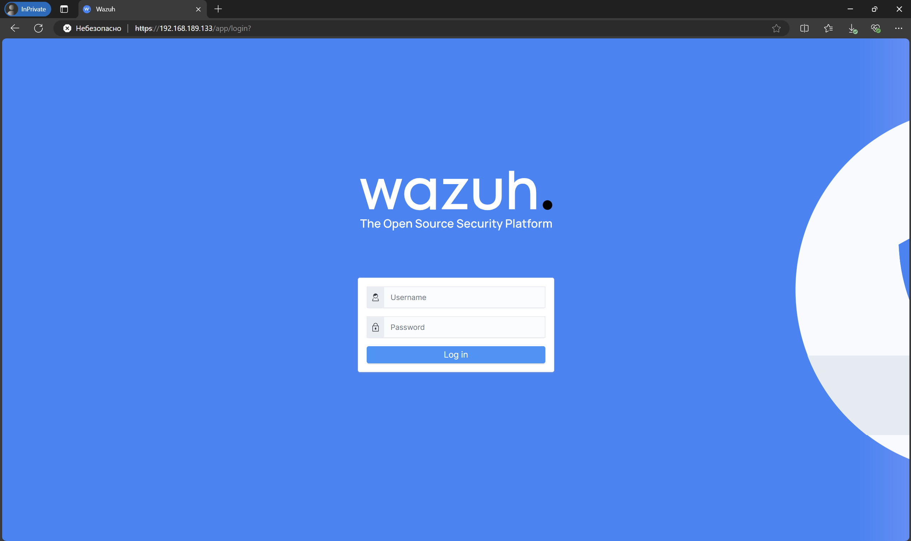
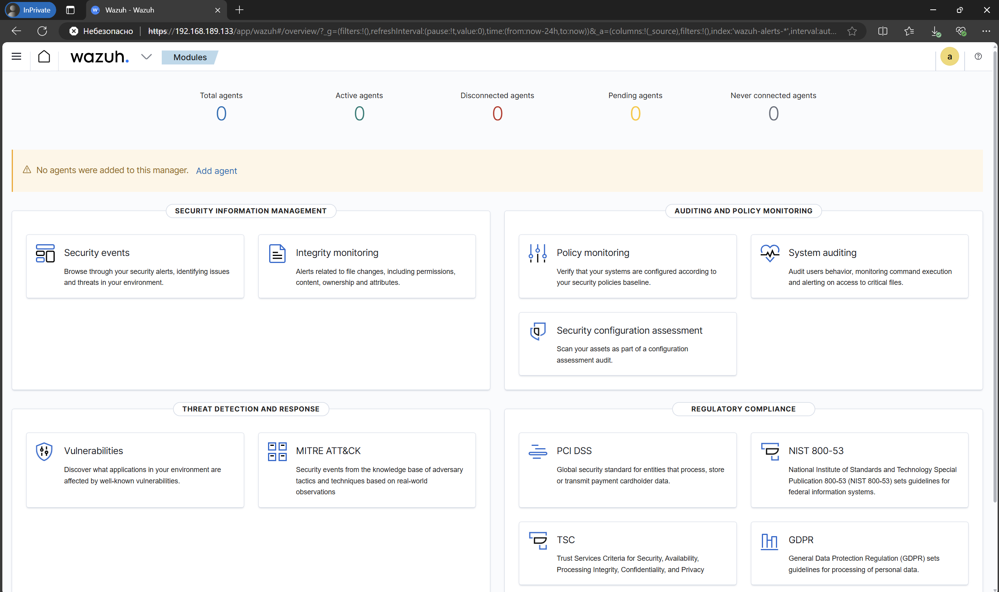
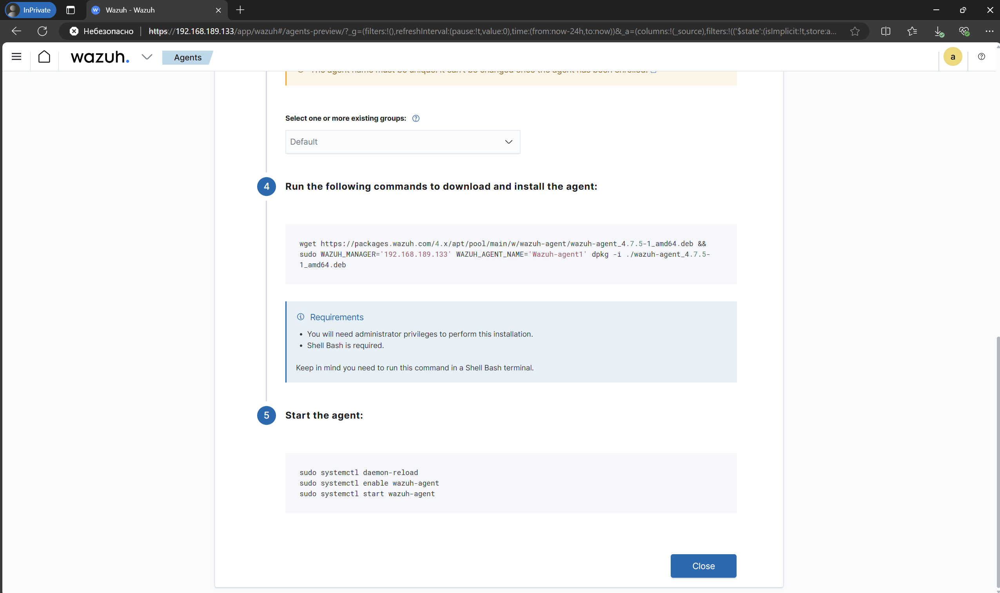
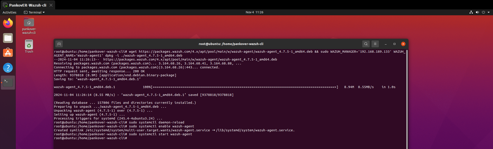
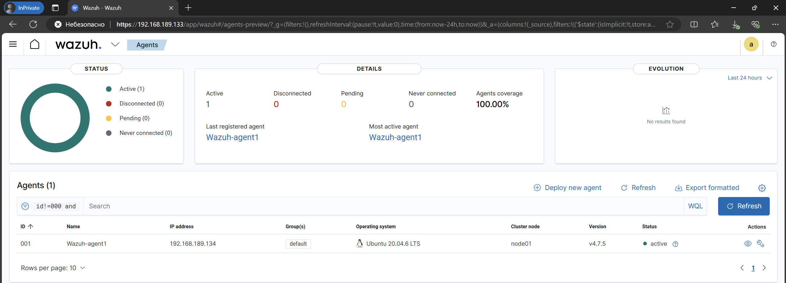
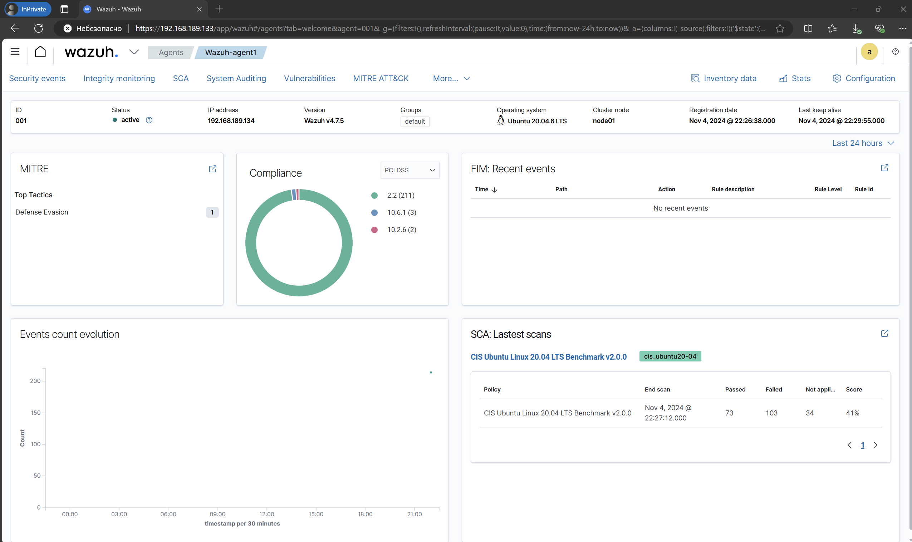

# **СДССиЛ Практическая работа номер 3 - WAZUH**
**Выполнил - Панков Евгений Ромуальдович**
# **Перейдем к процессу выполнения работы:**
## **Шаг 1 - Результат установки и настройки 2 ВМ (Сервер и Клиент):**

### **Проверим Ip адреса 2 ВМ:**

## **Шаг 2 - Проверка связи между двумя ВМ:**

### **Пропингуем две ВМ между собой:**

## **Шаг 3 - Установка Wazuh-сервера на серверной ВМ:**

### **Проверим результат установки и перейдем в web-интерфейс Wazuh:**

## **Шаг 4 -Перейдем к установке агента на клиентской ВМ:**
### **Сгенерируем команды в web-интерфейсе Wazuh:**

### **Выполним команды на клиентской ВМ:**

## **Шаг 5 - Проверка отображения нового агента в web-интерфейсе Wazuh**

### **Отбразим детектор уязвимостей для конкретного агента:**

