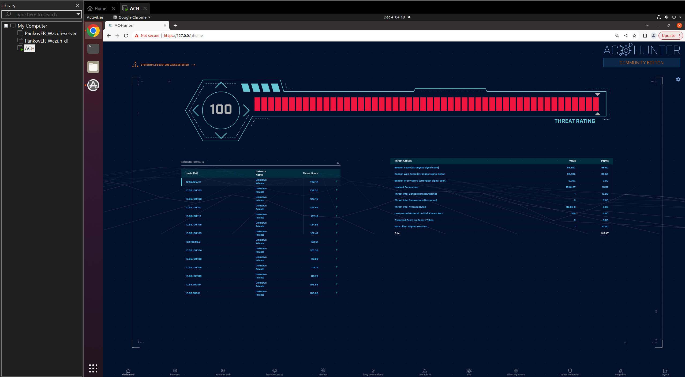
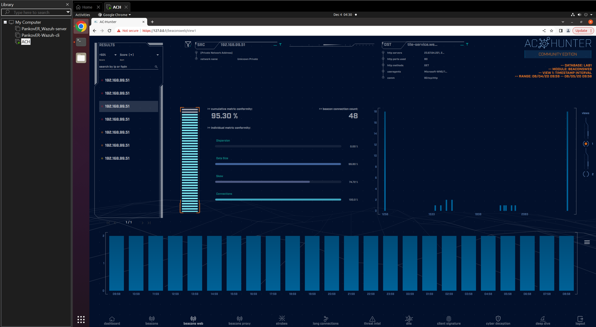

# **СДССиЛ Практическая работа номер 4 - Network Threat Hunter Training**
**Выполнил - Панков Евгений Ромуальдович**
# **Перейдем к процессу выполнения работы:**
## **Шаг 1 - Перейдем к выполнению задания lab1:**
### **1.1 Скачиваем и разворачиваем стенд:**

#### **1.1.1 WEb-интерфейс AC-hunter:**

### **1.2 Добавляем адрес в safelist с полученным траффиком к skype.com:**

#### **1.2.1 Проверяем safelist на наличие добавленного адреса:**

### **1.3 Переходим в директорию lab1, импортируем логи и переключаемся на них в WEB-интерфейсе стенда:**
#### **1.3.1 Переходим в директорию и импортируем логи:**

#### **1.3.2 Переключаемся на нужные логи в WEB-интерфейсе стенда:**

### **1.4 Переходим в модуль beaconsweb для анализа адресов:**
#### **1.4.1 Переходим в beaconsweb**

##### **1.4.1.1 Проверяем первый адрес из списка:**

Анализируемый адрес выглядит подозрительным. Показатель beaconscore очень высок, гистограмма активности слишком стабильная и обладает высокими показателями активности, так же адрес обладает большим количеством соеднинений. Кроме того не отображается имя хоста (нет доменного имени сервера)
##### **1.4.1.2 Проверим второй адрес из списка:**

Видим что данный адрес идентифицируется как хост оптимизации MS delivery, следоватлеьно не вызывает подозрений и не опасен. Может быть добавлен в safelist
##### **1.4.1.3 Проверим третий адрес из списка:**

Данный адрес идентифицируется какWindows tile services, не вызывает подозрений и не опасен. Может быть добавлен в safelist

При анализе последующих адресов было выяснено что они все относятся к Windows и все могут быть добавлены в safelist

##### **1.4.1.4 Отобразим safelist для проверки успешности добавления безопасных адресов:**

**В итоге из опасных адресов был найден один - первый**

#### **1.4.2 Перейдем к модулю long connections:**

Видим отображение двух адресов, проверим каждый из них на virus total

##### **1.4.2.1 Проверим адреса №1 на virus total:**

Для данного адреса есть одна пометка о его вредоносности

##### **1.4.2.2 Проверим адреса №2 на virus total:**

Отметок о вредоносности нет, относится к Windows - безопасен

#### **Проверим первый адрес на AbuseIPDB:**

Видим что был зарепорчен два раза как опасный
### **Вывод по lab1:**
Соединения с 104.248.234.238 выглядят подозрительно: найдено 3011 соединений с высоким beacons score, не было обнаружено поля «хост» в HTTP-заголовке, длинная запутанная строка URI. Кроме того было несколько репортов на ресурсах о вредоносности данного адреса. Остальные адреса безопасны, что мождно понять из вышеописанного анализа
