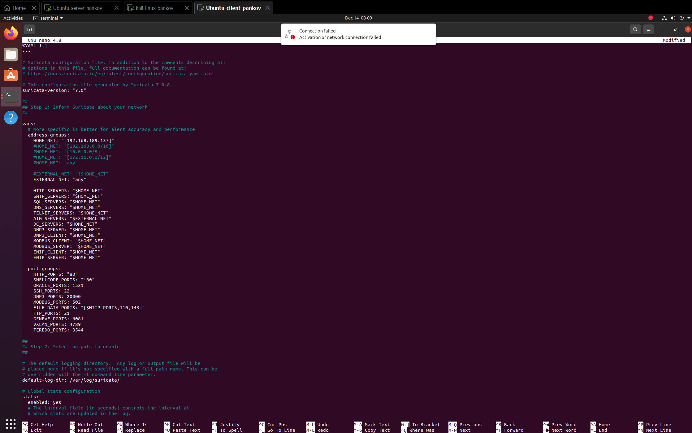
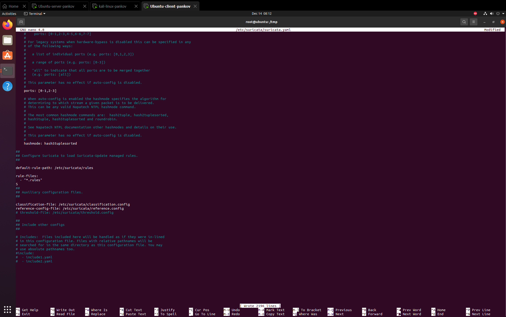
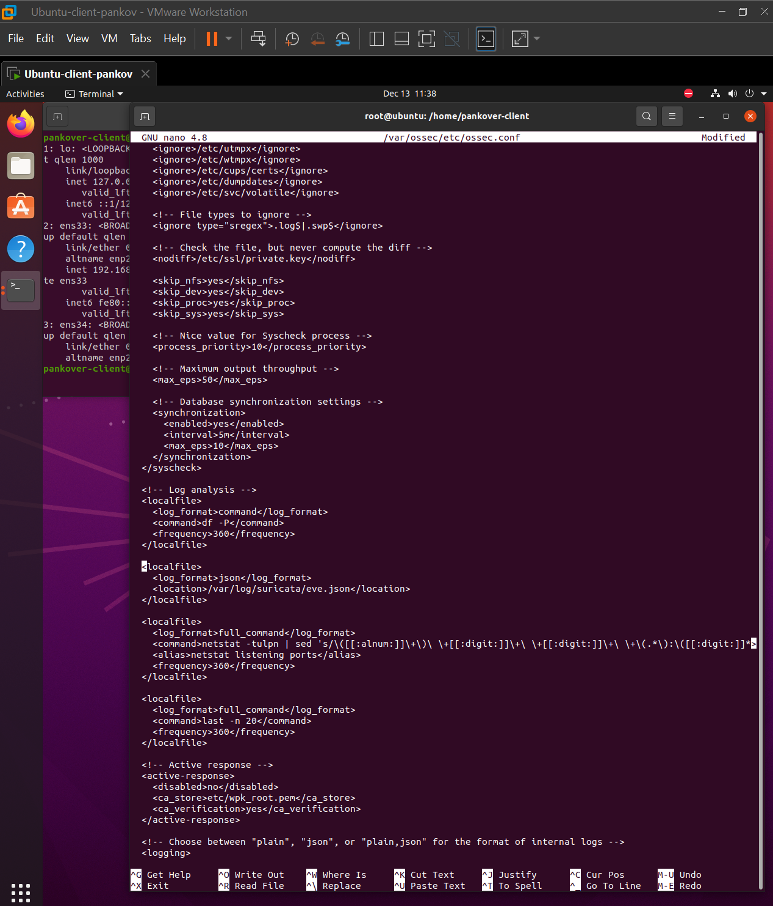
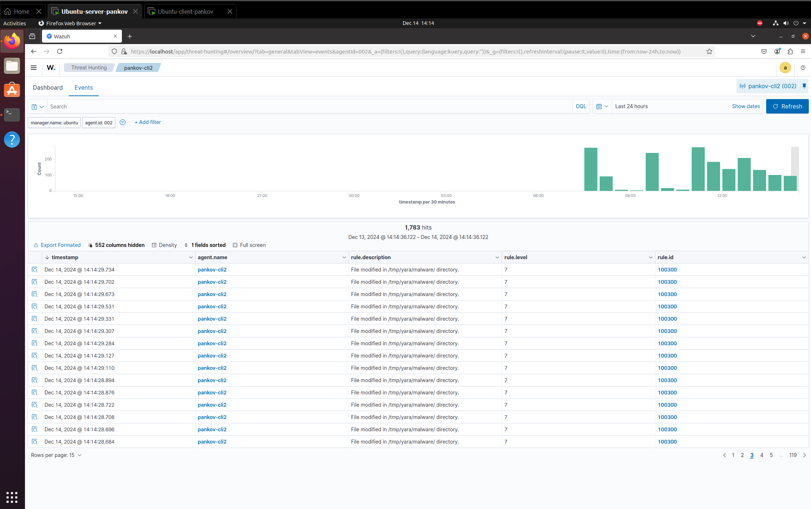

# **СДССиЛ Практическая работа номер 5 - Threat Hunting**
**Выполнил - Панков Евгений Ромуальдович**
# **Перейдем к процессу выполнения работы:**
## **1. Результат развертывания ВМ для выполнения работы:**
### **1.1 ВМ - Сервер (`Ubuntu`):**

### **1.2 ВМ - Клиент (`Ubuntu`):**

### **1.3 ВМ - Атакующая (`Kali`):**

### **1.4 Проверка связи между ВМ:**

## **2. Установка на серверную ВМ Сервера `Wazuh`:**

### **2.1 Проверка WEB-интерфейса `Wazuh-сервера`:**

## **3. Установка агента на клиентскую ВМ:**

### **3.1 Проверка отображения подключенного агента на `Wazuh-сервере`:**

## **4. Установка `Suricata IDS` на клиентскую ВМ:**

### **4.1 Установка набора правил для `Suricata`:**

### **4.2 Настройка конфигурации `Suricata IDS`:**

### **4.3 Настройка сбора логов и передачи в `Wazuh-сервер`:**

### **4.4 Проверка логов `Suricata` на `Wazuh-сервере`:**

## **5 Осуществление проверки работы правил `Suricata`:**
### **5.1 На ВМ Атакующая-Kali выполним ping на Клиентскую ВМ:**

### **5.2 Проверка на `Wazuh-сервере` наличия обнаружения активности и предупреждений:**

## **6 Установка `YARA` на клиентскую ВМ:**
### **6.1 Выполнение команд для установки `YARA` на Клиентсую ВМ:**

### **6.2 Проверка установки:**

###  **6.3 Исправление ошибки:**

### **6.4 Установка набора правил для `YARA`:**
Ошибки из-за отсутствия VPN

### **6.5 Создание скрипта `yara.sh` для получения данных сканирования в `Wazuh-сервер`:**

### **6.6 Выдача прав на скрипт `yara.sh`:**

### **6.7 Настройка сбора логов и передачи в `Wazuh-сервер`:**

## **7 Настройка Серверной ВМ для работы с `YARA`:**

## **8. Проверка результата подключения `YARA` к `Wazuh-серверу`:**
### **8.1 Создание скрипта для проверки `YARA` на Клиентской ВМ:**

### **8.2 Отображение результата в `Wazuh-сервере`:**

