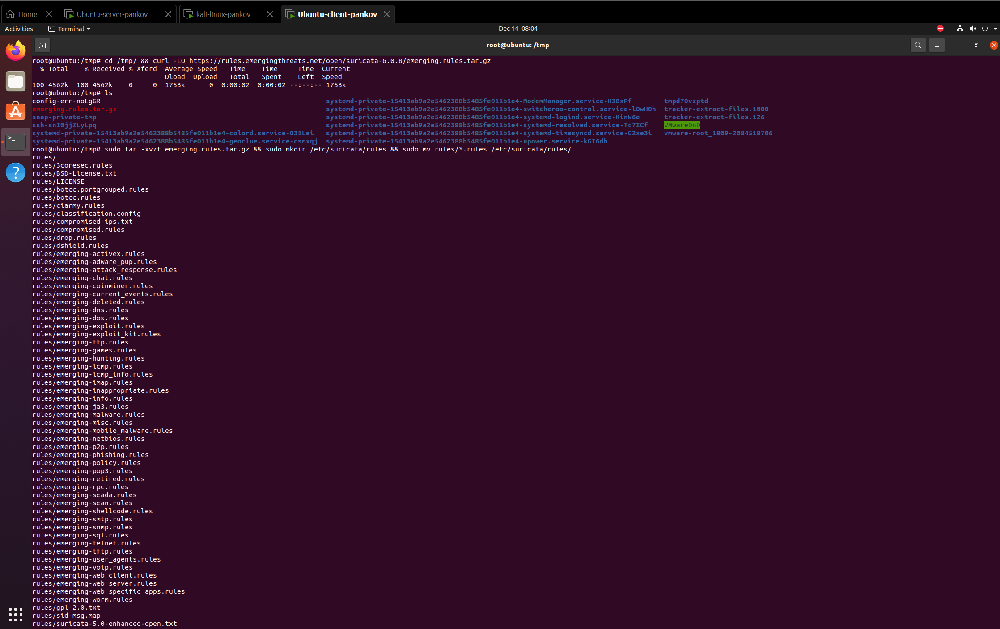

# **СДССиЛ Практическая работа номер 5 - Threat Hunting**
**Выполнил - Панков Евгений Ромуальдович**
# **Перейдем к процессу выполнения работы:**
## **1. Результат развертывания ВМ для выполнения работы:**
### **1.1 ВМ - сервер (`Ubuntu`):**

### **1.2 ВМ - клиент (`Ubuntu`):**

### **1.3 ВМ - атакующая (`Kali`):**

### **1.4 Проверка связи между ВМ:**

## **2. Установка на серверную ВМ Сервера `Wazuh`:**

### **2.1 Проверка WEB-интерфейса `Wazuh-сервера`:**

## **3. Установка агента на клиентскую ВМ:**

### **3.1 Проверка отображения подключенного агента на `Wazuh-сервере`:**

## **4. Установка Suricata IDS на клиентскую ВМ:**

### **4.1 Настройка конфигурации Suricata IDS:**

### **4.2 Настройка сбор логов и передачу в `Wazuh-сервер`:**

